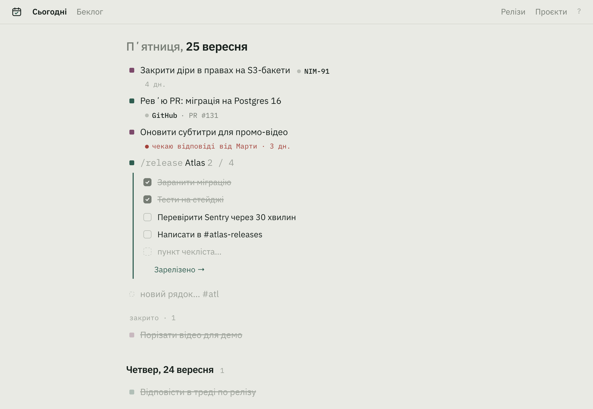
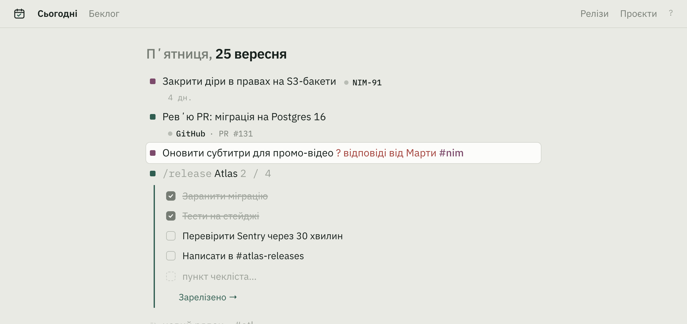
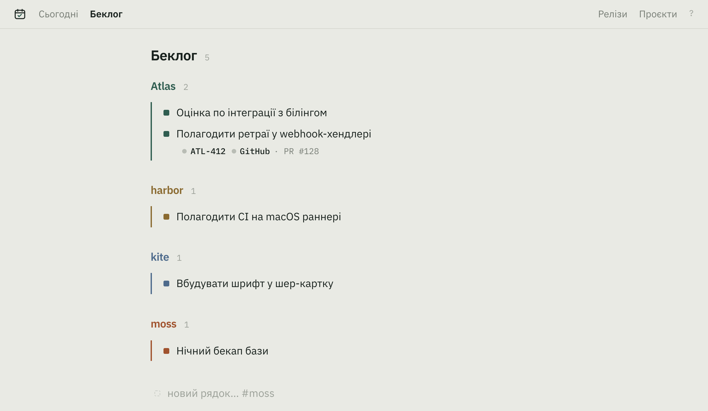
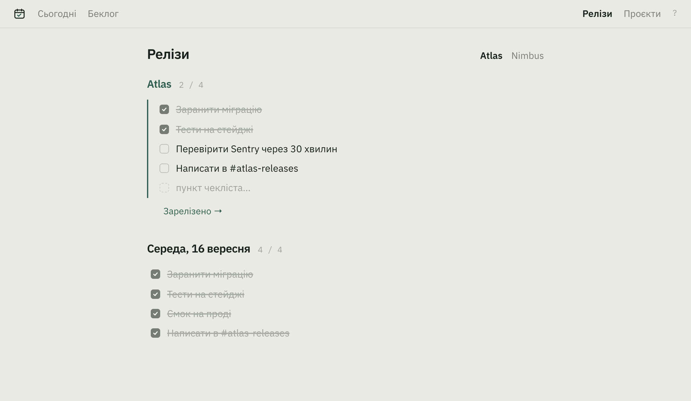
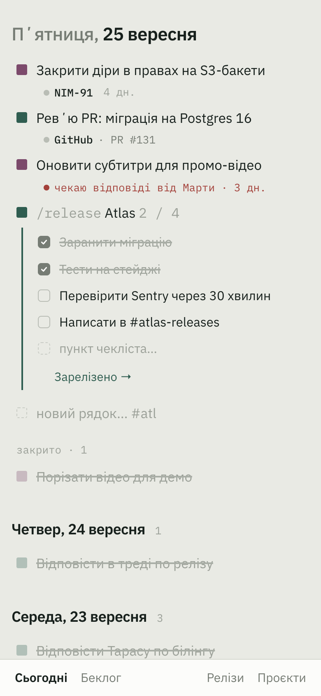

# Day Board

A notebook for the working day: one page per day, one line per task.
Write a line, strike it when it is done. Yesterday's struck lines sit under
today's — that is the standup.

Single user, self-hosted, one Go binary with SQLite. Go + htmx 4, no frontend
build, no dependencies beyond a pure-Go SQLite driver. The interface is
Ukrainian.

## A line is text

There are no forms. A line is one string, parsed when you save it:

| You type | What it means |
|---|---|
| `#atl` | the project; without a tag the line takes the project of the line above |
| `https://…` | a link becomes a chip — Jira, GitHub, GitLab, Slack, Figma, Notion, Sentry |
| `? відповіді від Марти` | the line waits on someone; it gets a red mark and a day count |
| `-> беклог` | at the end: the line leaves today for the backlog (`-> сьогодні` brings it back) |
| `/release #atl` | the project's release checklist unfolds under the line; «Зарелізено» archives it |

The editor is the same text, coloured, with the caret after the title:

Enter saves and opens the next line. An emptied line is deleted. Every
reversible action — strike, move, delete, send — shows «Скасувати ⌘Z» for five
seconds.

## Pages

**Сьогодні** — open lines in priority order (drag by the project square, or
⌥↑/⌥↓), the empty line to write into, today's struck lines, then earlier days
as a feed. A line open for three days or more says so quietly.

**Беклог** — the same lines, grouped by project. `b` or «→ сьогодні» moves one
to today.

**Релізи** — one checklist per work project, edited like any other lines, with
the history of past releases under it. A checklist line can point at a task.

**Проєкти** — name, tag, kind, colour. That is all a project is.

## Keyboard

Everything works without the mouse and in any layout (keys are read by
position, so the Ukrainian layout is fine).

| | |
|---|---|
| `↑` `↓` | walk lines, from the moment the page opens |
| `Enter` / `Esc` | edit the line / leave it |
| `x` or `⌘⏎` | strike, or bring back |
| `b` | send to the backlog, or to today |
| `⌫` | delete the line (`⌘Z` undoes) |
| `n` | new line |
| `1` `2` `3` `4` | Сьогодні / Беклог / Релізи / Проєкти |
| `?` | the full list |

On a phone the row of words moves to the bottom, the page is installable as a
PWA, and the words for a line («закреслити», «→ беклог») appear when you tap
its square. The service worker is network-first: a new build shows up on the
next reload.

 

## Run

    go run .            # http://localhost:8080, dayboard.db in the working directory
    go test ./...

No password is needed on a loopback address. Anywhere else the server refuses
to start without `PASSWORD` (or `INSECURE=1`).

| Variable | Default | Purpose |
|---|---|---|
| `ADDR` | `:8080` | listen address |
| `DB_PATH` | `dayboard.db` | SQLite file |
| `PASSWORD` | — | the one password; required off loopback |
| `BACKUP_DIR` | unset | nightly `VACUUM INTO` copies here, last 30 kept |
| `TZ` | system | timezone for day boundaries |
| `ENV_FILE` | `.env` | env file, read when a variable is not set |

## Deploy

    docker compose up --build

A multi-stage build into distroless, `CGO_ENABLED=0`, running as nonroot.
The database and its backups live on the `/data` volume; the image creates
`/data` owned by the nonroot uid so a fresh volume works on first start. The
image has no shell, so `zaval -healthcheck` is what the compose healthcheck
runs.

On Dokploy it is a **Compose** application: provider GitHub, branch `release`,
trigger On Push, compose path `./docker-compose.yml`, `PASSWORD` in
Environment, the domain on service `zaval` port `8080`.

A push to `main` is a release. [deploy.yml](.github/workflows/deploy.yml) runs
the tests and, when they pass, moves `release` to that commit; Dokploy sees the
push and rebuilds. A red test never moves `release`.

Backups: every night at 03:00 the server writes `dayboard-YYYY-MM-DD.db` into
`BACKUP_DIR` and keeps 30. To restore, stop the container and copy one over
`/data/dayboard.db`.

## Decisions

Why there is no board, no dates, no states to pick from, and what comes next
(live status on the chips): [PLAN.md](PLAN.md). Conventions for working on the
code: [CLAUDE.md](CLAUDE.md).
